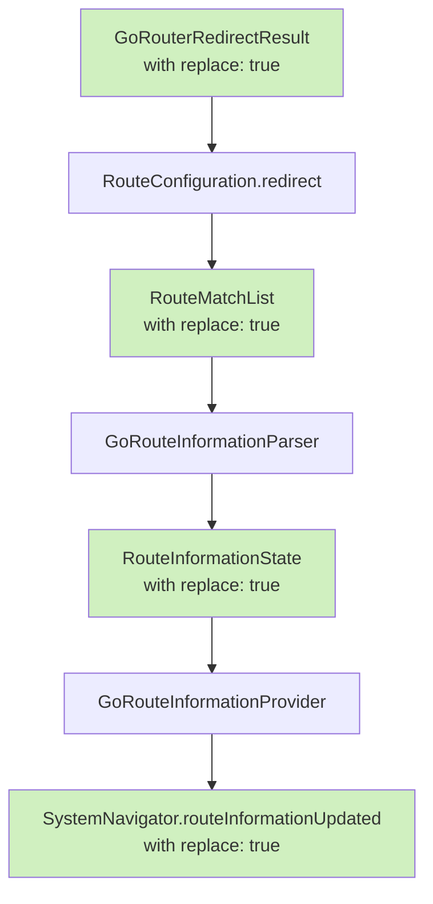
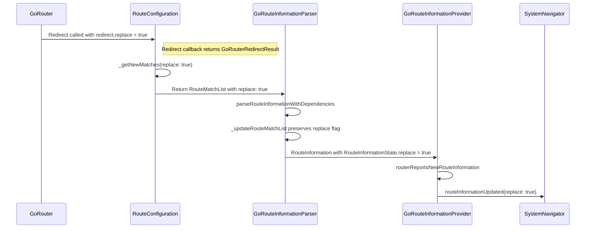
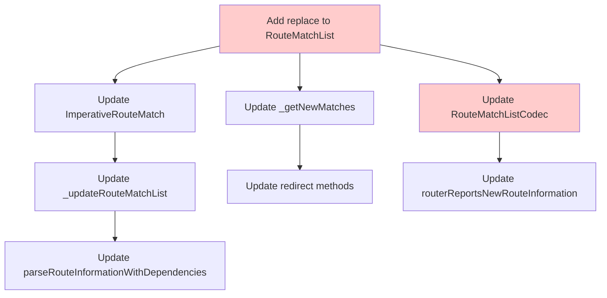

# Implementation Plan: GoRouterRedirectResult Replace Flag Flow

## Overview

The goal is to implement the flow of the `replace` property from `GoRouterRedirectResult` to the `SystemNavigator.routeInformationUpdated` call. When a redirect callback returns a `GoRouterRedirectResult` with `replace: true`, this flag should flow through the navigation pipeline so that `SystemNavigator.routeInformationUpdated` is called with `replace: true`.

## Data Flow Diagram



This diagram illustrates how the `replace` flag propagates through the system, from the initial `GoRouterRedirectResult` to the final `SystemNavigator.routeInformationUpdated` call.

## Current State

1. `GoRouterRedirectResult` class in `configuration.dart` has:
   - A `location` property with the redirect location
   - A `replace` property that defaults to `false`

2. When a redirect happens:
   - A redirect callback returns a `GoRouterRedirectResult` with potentially `replace: true`
   - This is processed by the `redirect` method in `configuration.dart`
   - The redirection result is handled by `parseRouteInformationWithDependencies` in `parser.dart`
   - Eventually, a route information update is reported through `routerReportsNewRouteInformation` in `information_provider.dart`
   - This method calls `SystemNavigator.routeInformationUpdated` with a `replace` parameter

3. Currently, the `replace` property from `GoRouterRedirectResult` is not passed along this chain to the final `SystemNavigator.routeInformationUpdated` call.

## Required Changes

### Sequence Diagram



This sequence diagram shows the interaction between the different components in the GoRouter system during a redirect operation, and how the `replace` flag is propagated through the system.

### 1. Modify `RouteMatchList` to carry the replace flag

The `RouteMatchList` class in `match.dart` needs to be extended to track whether it was created as a result of a redirect with `replace: true`. This modification will allow the replace flag to flow through the navigation pipeline.

```dart
class RouteMatchList {
  // Add new property
  final bool replace;
  
  // Update constructor
  const RouteMatchList({
    required this.matches,
    required this.uri,
    required this.pathParameters,
    this.error,
    this.extra,
    this.replace = false,
  });
  
  // Update copyWith method to include replace property
  RouteMatchList copyWith({
    List<RouteMatchBase>? matches,
    Uri? uri,
    Map<String, String>? pathParameters,
    GoException? error,
    Object? extra,
    bool? replace,
  }) {
    return RouteMatchList(
      matches: matches ?? this.matches,
      uri: uri ?? this.uri,
      pathParameters: pathParameters ?? this.pathParameters,
      error: error ?? this.error,
      extra: extra ?? this.extra,
      replace: replace ?? this.replace,
    );
  }
}
```

### 2. Update `_getNewMatches` in `configuration.dart`

The `_getNewMatches` method in `configuration.dart` needs to be updated to preserve the replace flag from `GoRouterRedirectResult`.

```dart
RouteMatchList _getNewMatches(
  String newLocation,
  Uri previousLocation,
  List<RouteMatchList> redirectHistory,
  {bool replace = false},
) {
  try {
    final RouteMatchList newMatch = findMatch(Uri.parse(newLocation))
        .copyWith(replace: replace);
    _addRedirect(redirectHistory, newMatch, previousLocation);
    return newMatch;
  } on GoException catch (e) {
    log('Redirection exception: ${e.message}');
    return _errorRouteMatchList(previousLocation, e);
  }
}
```

### 3. Update redirect methods in `configuration.dart`

The `processTopLevelRedirect` and `processRouteLevelRedirect` methods need to pass the replace flag from `GoRouterRedirectResult` to `_getNewMatches`.

For `processTopLevelRedirect`:
```dart
FutureOr<RouteMatchList> processTopLevelRedirect(
    GoRouterRedirectResult topRedirect) {
  if (topRedirect.location != null &&
      topRedirect.location != prevLocation) {
    final RouteMatchList newMatch = _getNewMatches(
      topRedirect.location!,
      prevMatchList.uri,
      redirectHistory,
      replace: topRedirect.replace,
    );
    if (newMatch.isError) {
      return newMatch;
    }
    return redirect(
      context,
      newMatch,
      redirectHistory: redirectHistory,
    );
  }
  // Rest of the method...
}
```

Similarly for `processRouteLevelRedirect`.

### 4. Update `RouteMatchListCodec` to include the replace flag

Instead of modifying `RouteInformationState`, we'll encode the replace flag in the `RouteMatchList` serialization, so it can be detected by the information provider:

```dart
class RouteMatchListCodec {
  // Existing code...
  
  Map<Object?, Object?> encode(RouteMatchList matchList) {
    // Existing encoding code...
    
    // Add replace flag to the encoded output
    final result = <Object?, Object?>{
      // Existing encoded fields...
      'replace': matchList.replace,
    };
    
    return result;
  }
  
  RouteMatchList decode(Map<Object?, Object?> data) {
    // Existing decoding code...
    
    // Read replace flag from the encoded data
    final bool replace = data['replace'] == true;
    
    return RouteMatchList(
      // Existing decoded fields...
      replace: replace,
    );
  }
}
```

This approach preserves compatibility since we're not changing any public API methods.

### 5. Update `parseRouteInformationWithDependencies` in `parser.dart`

The parser needs to propagate the replace flag from `RouteMatchList` to `RouteInformationState`.

```dart
Future<RouteMatchList> parseRouteInformationWithDependencies(
  RouteInformation routeInformation,
  BuildContext context,
) {
  // Existing code...
  
  return debugParserFuture = _redirect(
    context,
    initialMatches,
  ).then<RouteMatchList>((RouteMatchList matchList) {
    // Existing code...
    
    return _updateRouteMatchList(
      matchList,
      baseRouteMatchList: state.baseRouteMatchList,
      completer: state.completer,
      type: state.type,
      replace: matchList.replace, // Pass replace flag
    );
  });
}
```

### 6. Update `_updateRouteMatchList` in `parser.dart`

```dart
RouteMatchList _updateRouteMatchList(
  RouteMatchList newMatchList, {
  required RouteMatchList? baseRouteMatchList,
  required Completer<Object?>? completer,
  required NavigatingType type,
  bool replace = false,
}) {
  // Existing code...
  
  // When creating an ImperativeRouteMatch, include the replace flag
  return baseRouteMatchList.push(
    ImperativeRouteMatch(
      pageKey: _getUniqueValueKey(),
      completer: completer!,
      matches: newMatchList,
      replace: replace, // Include replace flag
    ),
  );
}
```

### 7. Update `ImperativeRouteMatch` in `match.dart`

```dart
class ImperativeRouteMatch extends RouteMatchBase {
  const ImperativeRouteMatch({
    required this.pageKey,
    required this.matches,
    required this.completer,
    this.replace = false,
  });

  final ValueKey<String> pageKey;
  final RouteMatchList matches;
  final Completer<Object?> completer;
  final bool replace;

  // Rest of the class...
}
```

### 8. Update `routerReportsNewRouteInformation` in `information_provider.dart`

The `routerReportsNewRouteInformation` method needs to be updated to respect the replace flag from `RouteInformationState`.

```dart
void routerReportsNewRouteInformation(
  RouteInformation routeInformation,
  {RouteInformationReportingType type = RouteInformationReportingType.none}
) {
  // GoRouteInformationParser should always report encoded route match list
  // in the state.
  assert(routeInformation.state != null);
  
  // Extract replace flag from state if it's a RouteInformationState
  final bool stateReplace = routeInformation.state is RouteInformationState
      ? (routeInformation.state as RouteInformationState).replace
      : false;
  
  bool replace;
  switch (type) {
    case RouteInformationReportingType.none:
      if (!_valueHasChanged(
          newLocationUri: routeInformation.uri,
          newState: routeInformation.state)) {
        return;
      }
      replace = _valueInEngine == _kEmptyRouteInformation || stateReplace;
    case RouteInformationReportingType.neglect:
      replace = true;
    case RouteInformationReportingType.navigate:
      replace = stateReplace;
  }
  
  SystemNavigator.selectMultiEntryHistory();
  SystemNavigator.routeInformationUpdated(
    uri: routeInformation.uri,
    state: routeInformation.state,
    replace: _routerNeglect || replace,
  );
  _value = _valueInEngine = routeInformation;
}
```

### 9. Alternative Approach for `RouteInformationState`

Instead of modifying the existing navigation methods, we will add functionality to detect redirects with `replace: true` and propagate that value internally. This approach avoids changing any public API methods.

```dart
// Inside information_provider.dart

// Use RouteMatchList.replace for determining the replace flag
void routerReportsNewRouteInformation(
  RouteInformation routeInformation,
  {RouteInformationReportingType type = RouteInformationReportingType.none}
) {
  // GoRouteInformationParser should always report encoded route match list
  // in the state.
  assert(routeInformation.state != null);
  
  final Object state = routeInformation.state!;
  
  // Check if this is a result of a redirect with replace: true
  // We can determine this from RouteMatchList's replace property
  final bool stateReplace = state is Map<Object?, Object?> &&
      state.containsKey('replace') && state['replace'] == true;
  
  bool replace;
  switch (type) {
    case RouteInformationReportingType.none:
      if (!_valueHasChanged(
          newLocationUri: routeInformation.uri,
          newState: routeInformation.state)) {
        return;
      }
      replace = _valueInEngine == _kEmptyRouteInformation || stateReplace;
    case RouteInformationReportingType.neglect:
      replace = true;
    case RouteInformationReportingType.navigate:
      replace = stateReplace;
  }
  
  SystemNavigator.selectMultiEntryHistory();
  SystemNavigator.routeInformationUpdated(
    uri: routeInformation.uri,
    state: routeInformation.state,
    replace: _routerNeglect || replace,
  );
  _value = _valueInEngine = routeInformation;
}
```

This approach requires ensuring that the `RouteMatchList` serialization/encoding includes the `replace` flag, which can be done in the `RouteMatchListCodec` class.

### 10. Update `RouteMatchListCodec` to include the replace flag

We need to ensure that the `replace` flag is included when encoding `RouteMatchList` objects, so it can be detected by the information provider:

```dart
class RouteMatchListCodec {
  // Existing code...
  
  Map<Object?, Object?> encode(RouteMatchList matchList) {
    // Existing encoding code...
    
    // Add replace flag to the encoded output
    final result = <Object?, Object?>{
      // Existing encoded fields...
      'replace': matchList.replace,
    };
    
    return result;
  }
  
  RouteMatchList decode(Map<Object?, Object?> data) {
    // Existing decoding code...
    
    // Read replace flag from the encoded data
    final bool replace = data['replace'] == true;
    
    return RouteMatchList(
      // Existing decoded fields...
      replace: replace,
    );
  }
}
```

## Testing

After implementing these changes, test the following scenarios:

1. A standard navigation with no redirects
2. A navigation that gets redirected with `replace: false`
3. A navigation that gets redirected with `replace: true`

Verify that in all cases, the browser history behaves correctly, with entries being replaced only when `replace: true` is specified.

## Impact Analysis

This change should improve the behavior of redirects with respect to browser history management. When a redirect happens with `replace: true`, the original navigation entry should be replaced in the browser history, leading to a cleaner and more predictable history stack.

The changes are backward compatible, as the default value for `replace` is `false`, matching the current behavior.

## Usage Examples

### Redirect with Replace in Route Definition

```dart
GoRoute(
  path: '/old-path',
  redirect: (context, state) {
    // Return a GoRouterRedirectResult with replace: true
    return GoRouterRedirectResult('/new-path', replace: true);
  }
),
```

### Redirect with Replace in Top-Level Router Configuration

```dart
GoRouter(
  routes: [...],
  redirect: (context, state) {
    if (!isLoggedIn && state.matchedLocation != '/login') {
      // Replace the current entry in history instead of adding a new one
      return GoRouterRedirectResult('/login', replace: true);
    }
    return null;
  },
);
```

## Edge Cases and Special Considerations

### Multiple Redirects in a Chain

When multiple redirects occur in a chain, the `replace` flag should be considered as follows:
- If any redirect in the chain has `replace: true`, the final navigation should use `replace: true`
- This requires ensuring the `replace` flag is preserved when combining multiple redirect results

### Web vs Non-Web Platforms

The `replace` flag has the most visible effect on web platforms, where it controls browser history behavior. However, it should be implemented consistently across all platforms for API compatibility.

### Interaction with Router Neglect

The router neglect flag (`_routerNeglect`) is combined with the `replace` flag using the OR operator in the `routerReportsNewRouteInformation` method. This means:
- If router neglect is true, replace will always be true regardless of the redirect's replace flag
- If router neglect is false, the replace flag from the redirect will determine the behavior

## Testing Strategy

### Unit Tests

1. **Redirect Flag Propagation**: Test that the `replace` flag correctly propagates from `GoRouterRedirectResult` through to `SystemNavigator.routeInformationUpdated`

```dart
test('replace flag from GoRouterRedirectResult propagates to routeInformationUpdated', () {
  // Mock the SystemNavigator
  final originalRouteInformationUpdated = SystemNavigator.routeInformationUpdated;
  bool? replaceValuePassedToNavigator;
  
  SystemNavigator.routeInformationUpdated =
      ({required Uri uri, Object? state, required bool replace}) {
    replaceValuePassedToNavigator = replace;
    return null;
  };
  
  try {
    // Setup a router with a redirect that uses replace: true
    final router = GoRouter(
      routes: [
        GoRoute(
          path: '/test',
          redirect: (_, __) => GoRouterRedirectResult('/redirected', replace: true),
        ),
      ],
    );
    
    // Navigate to trigger the redirect
    router.go('/test');
    
    // Verify that SystemNavigator.routeInformationUpdated was called with replace: true
    expect(replaceValuePassedToNavigator, isTrue);
  } finally {
    // Restore the original implementation
    SystemNavigator.routeInformationUpdated = originalRouteInformationUpdated;
  }
});
```

2. **RouteMatchList Encoding Test**: Test that the replace flag is properly encoded in the RouteMatchList

```dart
test('replace flag is properly encoded in RouteMatchList', () {
  // Create a RouteMatchList with replace: true
  final routeMatchList = RouteMatchList(
    matches: const <RouteMatch>[],
    uri: Uri.parse('/test'),
    pathParameters: const <String, String>{},
    replace: true,
  );
  
  // Encode the RouteMatchList
  final codec = RouteMatchListCodec(mockConfiguration);
  final encoded = codec.encode(routeMatchList);
  
  // Verify the replace flag is in the encoded data
  expect(encoded['replace'], isTrue);
  
  // Decode and verify the replace flag is preserved
  final decoded = codec.decode(encoded);
  expect(decoded.replace, isTrue);
});
```

### Integration Tests

1. **Browser History Test**: On web platforms, test that browser history entries are correctly replaced when using `replace: true`

```dart
testWidgets('redirect with replace: true replaces browser history entry', (tester) async {
  // Setup app with router that has redirect with replace: true
  
  // Perform navigation that triggers redirect
  
  // Verify browser history length hasn't increased
  // This would require platform-specific testing on web
});
```

2. **Multiple Redirects Test**: Test chains of redirects with various combinations of the `replace` flag

## Implementation Files Summary

Here's a summary of the files that need to be modified:

| File | Changes |
|------|---------|
| `match.dart` | Add `replace` property to `RouteMatchList` and `ImperativeRouteMatch` |
| `configuration.dart` | Update `_getNewMatches` to include `replace` parameter and update redirect methods |
| `information_provider.dart` | Update `routerReportsNewRouteInformation` to detect replace flag in encoded state |
| `parser.dart` | Update `parseRouteInformationWithDependencies` and `_updateRouteMatchList` to propagate replace flag |
| `match.dart` (or codec file) | Update `RouteMatchListCodec` to include replace flag in encoded/decoded data |

## Dependencies Between Changes



This dependency graph shows the relationships between the various changes that need to be made. Changes to the data classes (`RouteMatchList` and `RouteInformationState`) are the foundation, and other changes build upon them.

## Implementation Phases

To minimize risk, the implementation could be broken down into phases:

1. **Phase 1**: Modify `RouteMatchList` and `ImperativeRouteMatch` to include the `replace` property
2. **Phase 2**: Update the `RouteMatchListCodec` to handle encoding/decoding of the replace flag
3. **Phase 3**: Update the redirect handling in `configuration.dart` to set the replace flag
4. **Phase 4**: Update the parser to propagate the replace flag
5. **Phase 5**: Update the information provider to detect and use the replace flag from encoded state
6. **Phase 6**: Add tests to verify the behavior works as expected

This approach preserves the existing public API methods while still implementing the desired functionality. The key advantage is that we don't need to modify any public navigation methods, which minimizes the risk of breaking existing code.

This phased approach allows for incremental testing at each step to ensure the changes don't introduce regressions.

## Performance Considerations

The proposed changes add a small amount of additional state (a boolean flag) to several classes, which has minimal performance impact. The processing required to propagate this flag through the navigation pipeline is also minimal.

There are no significant performance concerns with this implementation. The changes:
- Do not add computational complexity to any algorithms
- Do not increase memory usage significantly
- Do not introduce new asynchronous operations

## Documentation Updates

Once implemented, the following documentation updates should be made:

1. Update the documentation for `GoRouterRedirectResult` to explain the purpose and behavior of the `replace` property
2. Add examples in the redirection documentation showing how to use the `replace` property for cleaner history management
3. Update any relevant navigation examples that demonstrate redirection

These documentation changes should be made in:
- Class documentation (dartdocs)
- The package's README.md
- The redirection.md document in the doc/ directory

## Alternatives Considered

### 1. Adding a replace parameter to redirect callbacks

Instead of enhancing `GoRouterRedirectResult`, we could have added a `replace` parameter to the redirect callback signature:

```dart
typedef GoRouterRedirect = FutureOr<String?> Function(
    BuildContext context, GoRouterState state, {bool replace});
```

This approach was rejected because:
- It would require changing the signature of all existing redirect callbacks
- It would be less clear how to specify the replace behavior
- It wouldn't allow for other redirect-specific options to be added in the future

### 2. Auto-replacing all redirects

Another alternative would be to always use `replace: true` for all redirects, automatically replacing the history entry for any redirection.

This approach was rejected because:
- It would change existing behavior, potentially breaking apps
- Different redirects might have different requirements for history behavior
- Developers might want control over which redirects replace history entries and which add new ones

## Conclusion

The proposed implementation provides a clean, backward-compatible way to control whether redirects replace the current history entry. By enhancing `GoRouterRedirectResult` with a `replace` property and ensuring it flows through the navigation pipeline to `SystemNavigator.routeInformationUpdated`, we enable more flexible control over browser history management during redirections.

This approach maintains compatibility with existing code while adding new functionality, provides a clean API for developers, and addresses the specific use case of controlling history entries during redirects.

## Summary of Revised Approach

Our implementation plan has been revised based on the requirement not to modify any existing navigation methods (`go`, `push`, `pushReplacement`, `replace`, `restore`, etc.). The revised approach:

1. Adds a `replace` property to `RouteMatchList` and `ImperativeRouteMatch`
2. Updates `RouteMatchListCodec` to include the replace flag in serialized data
3. Updates `configuration.dart` to propagate the replace flag from `GoRouterRedirectResult`
4. Updates the parser to preserve the replace flag during redirection
5. Updates the information provider to detect the replace flag from encoded state

This approach maintains backward compatibility and doesn't require any changes to public API methods, while still providing the desired functionality.

The implementation is minimally invasive, as it:
- Avoids changing method signatures of public APIs
- Works within the existing navigation pipeline
- Only adds properties and updates internal behavior
- Preserves backward compatibility

Once implemented, users will be able to control the browser history behavior during redirects by specifying `replace: true` in their `GoRouterRedirectResult` instances, without needing to modify their existing navigation code.
